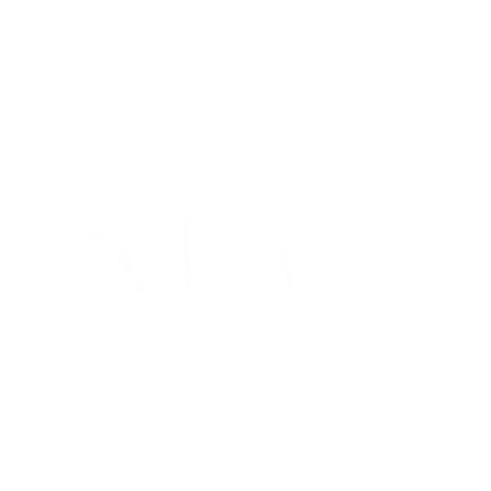

<p align=center>
  
</p>
<h1 align=center>Quasar Engine</h1>
<p align=center>
  
  <a href="https://choosealicense.com/licenses/mit/">
    
  </a>
  <a href="https://discord.gg/">
    
  </a>
</p>
<h3 align=center>Quasar Engine is a free, open-source game engine</h3>

- [A _bit_ of history](#a-bit-of-history)
- [The `Project`](#the-project)
- [Requirements](#requirements)
- [Install](#install)
- [License](#license)

# A _bit_ of history

The idea came to me while creating my first software, which was a curve editor using interpolation and Perlin noise to generate heightmaps. This tool later served as the basis for my first game engine capable of generating voxel worlds. Unsatisfied with the limitations of my first engine, I set out to develop a generic game engine with a graphical interface. This engine will allow users to create their own video games without complex technical constraints.

## The `Project`

The project aims to create an open-source game engine that can handle large projects, allowing developers to easily add the features they need, serving as a base even for beginners.

# Requirements

- Visual Studio
- Visual C++ Redistributable

## Libraries Used

- [GLFW](https://github.com/glfw/glfw) - A library for creating windows with OpenGL contexts and managing input.
- [Glad](https://github.com/Dav1dde/glad) - An OpenGL function loader.
- [glm](https://github.com/g-truc/glm) - A mathematics library for graphics software.
- [filewatch](https://github.com/pyloque/filewatch) - A library for file change notifications.
- [ImGui](https://github.com/ocornut/imgui) - A bloat-free graphical user interface library for C++.
- [Qt](https://www.qt.io/) - A framework for developing cross-platform applications.
- [Assimp](https://github.com/assimp/assimp) - A library to import and export various 3D model formats.
- [stb_image](https://github.com/nothings/stb) - A single-file public domain library for image loading.
- [yaml_cpp](https://github.com/jbeder/yaml-cpp) - A YAML parser and emitter in C++.
- [ImGuizmo](https://github.com/CedricGuillemet/ImGuizmo) - A simple and easy-to-use gizmo for 3D transformation manipulation in ImGui.
- [tinyfiledialogs](https://github.com/nativefiledialog/tinyfiledialogs) - A cross-platform C library for simple dialog boxes.
- [reactphysics3d](https://github.com/DigiPenInstituteOfTechnology/ReactPhysics3D) - A physics engine for 3D games.
- [mbedtls](https://github.com/Mbed-TLS/mbedtls) - A C library for SSL and TLS protocols.
- [zlib](https://github.com/madler/zlib) - A compression library used for data compression.
- [entt](https://github.com/skypjack/entt) - A fast and reliable entity-component-system library.
- [tinygltf](https://github.com/syoyo/tinygltf) - A header-only C++ library for loading glTF 2.0 files.

## Install

```bash
$ git clone https://github.com/Ultiris-Studio/QuasarEngine/
$ cd QuasarEngine
$ ./scripts/Win_Setup.bat
$ ./scripts/Win-GenProjects.bat
