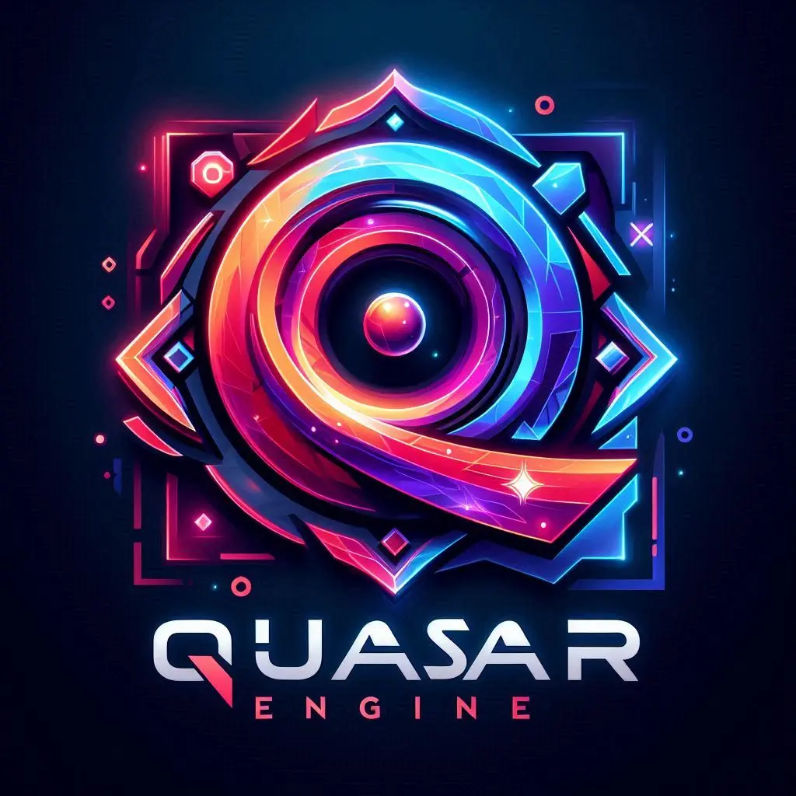

<p align=center>
  
</p>
<h1 align=center>Quasar Engine</h1>
<p align=center>
  
  <a href="https://choosealicense.com/licenses/mit/">
    
  </a>
  <a href="https://discord.gg/">
    
  </a>
</p>
<h3 align=center>Quasar Engine est un moteur de jeu</h3>

- [Un _peu_ d'histoire](#un-peu-d-histoire)
- [Le `Projet`](#le-projet)
- [Requirements](#requirements)
- [Install](#install)
- [Run](#run)
- [License](#license)

# Un _peu_ d'histoire

L'idée m'est venue en créant mon premier logiciel qui était un éditeur de courbes utilisant l'interpolation et le bruit de Perlin pour générer des heightmaps. Cet outil servait ensuite pour mon premier moteur de jeu capable de générer des mondes voxels. Insatisfait des limitations de mon premier moteur, j'ai entrepris de développer un moteur de jeu générique doté d'une interface graphique. Ce moteur permettra aux utilisateurs de créer leurs propres jeux vidéo sans contraintes techniques complexes.

## Le `Projet`

Le projet était donc de créer un moteur de jeu OpenSource pouvant gérer de gros projets et dont les développeurs pourraient ajouter les fonctionnalités dont ils auraient besoin d'une manière simple dont même les débutants pourraient se servir comme base.

# Requirements

- Visual Studio
- Visual Redistribuable

## Install

```bash
$ git clone https://github.com/Kurogenshi/VulkanEngine/
$ cd OpenGLEngine
$ ./scripts/Win_Setup.bat
$ ./scripts/Win-GenProjects.bat
```

## Run

Une fois le dépôt cloné et le projet générer, le programme peux etre compilé et éxécuté (Debug ou Release)
Une fois le programme lancé une fenêtre propose de crée un projet.
Une fois le nom et le chemin d'accée indiqué il faut fermer le programme et le relancer pour que le moteur démarre sur le projet.

Pour que le chargement des scène avec les objets primitifs (cube, sphere et plan) puisse fonctionner il faut copier le dossier "Models" du dossier "QuasarEngine-Editor/Assets" dans le dossier "Asset" de votre projet.
(Optionnel mais nécessaire pour pouvoir charger des scènes qui utilise ces objets)

A ce niveau tout est bon pour pouvoir utiliser le moteur dans son état actuel de fonctionnement

## License

[MIT](https://choosealicense.com/licenses/mit/)
